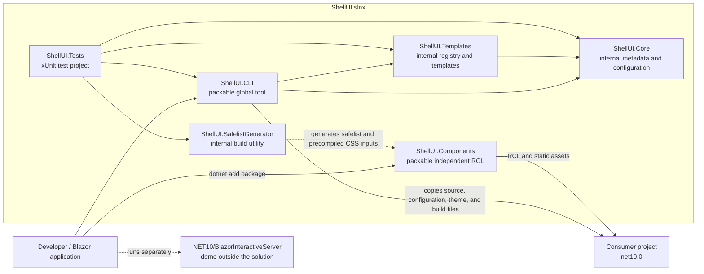

# ShellUI Architecture

This document describes the current ShellUI source tree. The current source version is `0.4.0-alpha.1`; source version, local build output, and published package availability are separate concerns.

## Current Baseline

| Area | Current value |
|---|---|
| Source version | `0.4.0-alpha.1` |
| Target framework | .NET 10 (`net10.0`) |
| Tailwind CSS | `4.3.2` |
| Solution | `ShellUI.slnx` |
| Solution projects | 6 |
| Registry | 173 entries: 73 direct targets and 100 hidden dependency entries |

ShellUI is a CLI-first Blazor component library. The CLI copies source into a consumer project, while `ShellUI.Components` is an independent Razor class library (RCL) for consumers who prefer NuGet.

## Architecture Graph



The six nodes inside `ShellUI.slnx` are the solution projects. The demo at `NET10/BlazorInteractiveServer` is intentionally outside the solution and is not a seventh solution project.

## Solution and Project Topology

| Project | Role | Packable |
|---|---|---|
| `src/ShellUI.CLI/ShellUI.CLI.csproj` | .NET global tool and source-copy CLI | Yes |
| `src/ShellUI.Components/ShellUI.Components.csproj` | Packable Razor class library containing the runtime component set and static assets | Yes |
| `src/ShellUI.Core/ShellUI.Core.csproj` | Shared configuration, metadata, Tailwind constants, and models | No |
| `src/ShellUI.Templates/ShellUI.Templates.csproj` | Internal component registry and generated source templates | No |
| `tools/ShellUI.SafelistGenerator/ShellUI.SafelistGenerator.csproj` | Build-time Tailwind safelist and CSS bundle utility | No |
| `ShellUI.Tests/ShellUI.Tests.csproj` | xUnit, Roslyn, and coverlet test project | No |

`ShellUI.CLI` has project references to `ShellUI.Core` and `ShellUI.Templates`. `ShellUI.Templates` references `ShellUI.Core`. `ShellUI.Components` has no project reference to the CLI, Core, or Templates and is therefore an independent RCL. `ShellUI.Core`, `ShellUI.Templates`, the safelist utility, and the test project are not published NuGet packages.

## Distribution Boundaries

- `ShellUI.CLI` is configured with `PackAsTool` and installs as a .NET global tool. Its `add` command writes generated source to the consumer project.
- `ShellUI.Components` is the only runtime component package. It can be consumed independently through NuGet and does not require the CLI at compile time.
- The CLI uses the internal Core and Templates projects at build time. Consumers do not need to reference either project.
- The six-project solution can be built and tested together, but the demo must be addressed explicitly because it is outside `ShellUI.slnx`.

## Command Surface

The implemented command tree is:

| Command | Responsibility |
|---|---|
| `shellui init` | Detect a Blazor project, configure Tailwind, install bootstrap assets, create `shellui.json`, patch the host, and create the MSBuild integration. |
| `shellui add <components...>` | Install one or more direct targets and recursively install their registry dependencies. |
| `shellui list` | List direct targets, with installed/available filtering. |
| `shellui remove <components...>` | Remove selected installed source files and update `shellui.json`. |
| `shellui update [components...]` | Rewrite selected installed source files, or all installed components with `--all`. |
| `shellui theme init <url-or-id>` | Initialize a project and apply a fetched theme in one operation. |
| `shellui theme apply <url-or-id>` | Apply a theme to `wwwroot/input.css` or emit a standalone override. |
| `shellui theme update` | Re-fetch the theme recorded in `shellui.theme.lock`. |

`init` accepts `--force`, `--style`, `--tailwind standalone|npm`, and `--yes`. `add` accepts space- or comma-separated component names and `--force`. The command surface above is the current implementation; commands not listed here are not part of the current CLI.

## Registry Model and Counts

`ComponentRegistry` contains 173 metadata entries:

| Registry classification | Count | Meaning |
|---|---:|---|
| Direct targets | 73 | Entries with `IsAvailable = true`; these are the normal targets shown by `shellui list`. |
| Hidden entries | 100 | Entries with `IsAvailable = false`; these are generally installed through a parent target. |
| **Total** | **173** | All registered templates, sub-components, variants, models, services, and assets. |

A dependency entry is still real source and is written to the consumer project when the dependency walk reaches it. The two counts describe registry visibility, not two different component libraries.

## Data Flow: `shellui add`

1. The CLI verifies that `shellui.json` exists and loads the configured component and layout paths.
2. It detects the consumer project and parses the requested names, accepting space- and comma-separated input.
3. Each requested name is looked up in `ComponentRegistry`. A missing name produces an error and a closest-match suggestion when one exists.
4. The installer walks `Dependencies` recursively before writing the requested target. Hidden entries are installed through this walk rather than being presented as normal public targets.
5. The installer retrieves the template content, substitutes the consumer namespace, and writes it according to the metadata `FilePath` under `Components/UI`, `Components/Layout`, or a project `wwwroot` path.
6. Required NuGet dependencies are collected during the walk and added once per package after source files are written. CSS assets are linked into the host when applicable.
7. The installer records each installed name, computed version, installation time, and customization state in `shellui.json`.
8. The generated MSBuild integration runs Tailwind during the consumer build, producing the configured CSS output.

`remove` deletes the selected installed file and removes its record. The current remove path is optimized for regular component targets; layout blocks should be removed manually from `Components/Layout` until layout-aware removal is implemented. `update` rewrites selected source from the current registry and records the installed version. Theme commands use a separate managed CSS region and write `shellui.theme.lock`; theme updates re-fetch the recorded source rather than changing the component version.

## Build and Test Flow

The repository uses the .NET 10 SDK selected by `global.json`. Node.js is optional: standalone Tailwind uses the downloaded CLI, while the npm method requires Node.js.

```bash
dotnet restore ShellUI.slnx
dotnet build ShellUI.slnx --configuration Release
dotnet test ShellUI.slnx --no-restore --no-build --configuration Release --verbosity normal
dotnet pack ShellUI.slnx --no-build --configuration Release
```

When component CSS or the safelist changes, regenerate the safelist and then build the bundle:

```bash
dotnet run --project tools/ShellUI.SafelistGenerator -- src/ShellUI.Components/Components src/ShellUI.Components/wwwroot/shellui-classes.txt src/ShellUI.Components/build/ShellUI.Components.targets
bash scripts/rebuild-precompiled-css.sh
```

The generator updates the class list and package targets; the CSS script consumes those files.

CI then performs a Release build and test run, followed by CLI scaffolding and NuGet-only smoke checks. The test project currently uses xUnit, `Microsoft.NET.Test.Sdk`, Roslyn (`Microsoft.CodeAnalysis.CSharp`), and `coverlet.collector`. It does not currently contain a bUnit, FluentAssertions, or browser-automation suite; tests should use the existing infrastructure or propose a new harness before assuming one.

The demo runs independently:

```bash
dotnet run --project NET10/BlazorInteractiveServer/BlazorInteractiveServer.csproj
```

## Design Boundaries

- Source ownership is the primary CLI workflow; the NuGet RCL is a separate delivery path.
- Tailwind CSS `4.3.2` and its CSS-variable theme are the styling baseline.
- Dependency metadata is part of the registry contract, not an incidental installer detail.
- Accessibility patterns are implemented where appropriate, but this document makes no blanket accessibility-conformance claim.
- Internal projects and the demo are repository development assets, not additional published packages.

## Related Documentation

- [Project overview](../README.md)
- [Project status](PROJECT_STATUS.md)
- [Quick start](QUICKSTART.md)
- [CLI syntax](CLI_SYNTAX.md)
- [CLI installation](CLI_INSTALLATION.md)
- [Component dependencies](COMPONENT_DEPENDENCIES.md)
- [Tailwind setup](tailwind-setup.md)
- [Contributing](CONTRIBUTING.md)
- [Versioning strategy](../VERSIONING_STRATEGY.md)
- [Historical release notes](RELEASE_NOTES.md)
